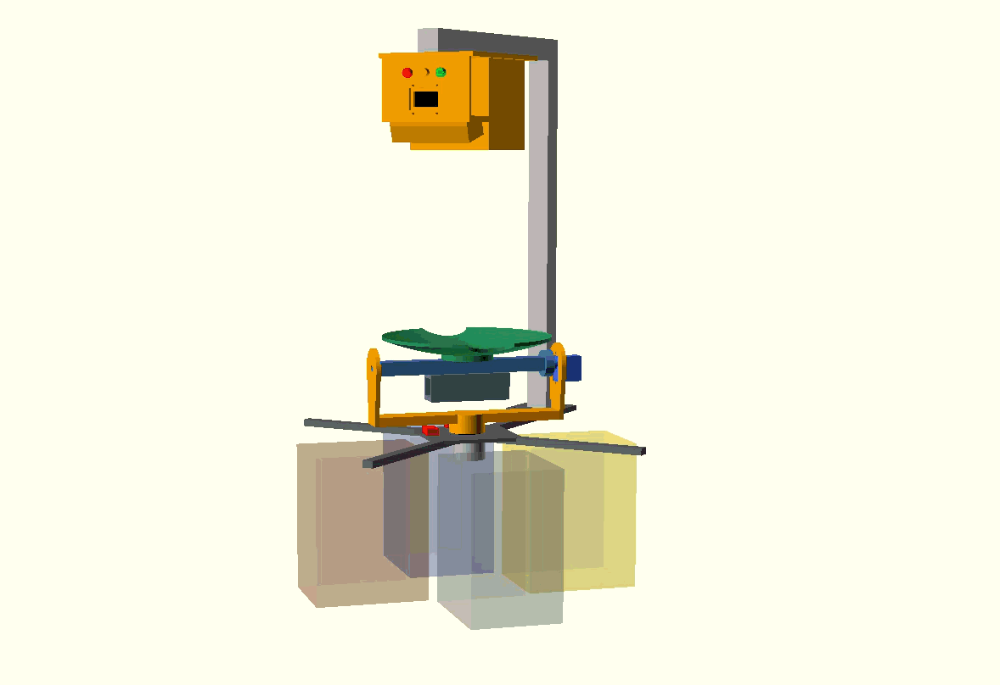

# Smart Tilting Bin

A refuse sorter that sees, hears and learns, built with reused materials.

A camera looks down at the object you drop in, an AI model decides which of four fractions it belongs to (packaging, paper, organic, general waste), and a rotating-tilting tray drops it into the right container. Two small motors reach four containers.

> Work in progress. This repository holds the parametric mechanical model and the simulation. It is part of my application to the element14 "My Project Is Trash" design challenge. Software and results will be added as the project advances.



## How it works

1. The user drops an object onto the tray, which rests horizontally.
2. An impact triggers a capture: a top-down Logitech C170 takes a photo and its microphone records the impact sound.
3. A Raspberry Pi CM4 classifies image and sound and maps the class to one of the four containers.
4. If the container is in line with the current tray position, the tray only tilts to +45 or -45 degrees. Otherwise the stepper first rotates the tray 90 degrees, stops, and then the tray tilts to the correct side.
5. The object slides through one of the two bites in the tray rim and falls into the container.
6. The tray returns to horizontal and LEDs and an OLED report the result.

```
               [ PAPER ]
                   |
 [ PACKAGING ] --- O --- [ ORGANIC ]
                   |
            [ GENERAL WASTE ]

 O = tray axis. At rotation 0 the tray tilts towards PAPER or
 GENERAL WASTE, at rotation 90 towards PACKAGING or ORGANIC.
```

## Mechanism

- **Base:** a fixed plate holds a 28BYJ-48 stepper (ULN2003 driver) with a vertical shaft. There is no solid disc under the tray, so objects fall freely.
- **Yoke:** a U-shaped yoke on the stepper shaft rotates between 0 and 90 degrees (two microswitches provide homing) and carries the tilt axis and an SG90 servo.
- **Tilt axis:** a horizontal beam. One end is a simple pivot and the other is coupled directly to the servo horn, so 90 degrees of servo travel gives +/-45 degrees of tilt.
- **Tray:** 150 mm, concave, with two round bites on the rim, perpendicular to the tilt axis.
- **Counterweight:** a printed holder under the beam with a sliding steel bar, so the servo hardly works at rest and the tray settles horizontal by itself.
- **Sensor support:** an "L" or arch bolted to a diagonal strut holds the camera above the tray. Its front wall faces the user and carries three LEDs, an OLED and, underneath, the IR light angle sensor aimed at the tray.

## Hardware

| Part | Role |
|---|---|
| Analog Devices EVAL-ADXL372Z | Vandalism and heavy-object protection, capture trigger, impact signature |
| Analog Devices EVAL-CN0569-PMDZ | IR gesture selection of the bin, labelling, game controller, hand detection |
| Hammond 1554X2GYCL (IP68) | Sealed enclosure for the electronics |
| CamdenBoss IND514113-LED | Green, amber and red status LEDs |
| CamdenBoss CTBP92HD/4 and CTBP93HD/4 | Pluggable terminal blocks |
| CamdenBoss CSM40500A | Limit switches for homing |

Complementary hardware (not in the kit): Raspberry Pi CM4 on a Waveshare CM4-NANO-A (or Pi 4 / Pi 5), Logitech C170, 28BYJ-48 with ULN2003, SG90 servo and an SSD1306 OLED.

## OpenSCAD model

Open `cad/smart_tilting_bin.scad` with OpenSCAD 2021.01 or later. Every dimension is a variable, so you can adapt the model to the materials you find (a salad bowl as the tray, a curtain-rod tube as the beam, and so on).

Main parameters:

| Parameter | Meaning |
|---|---|
| `part` | `"assembly"`, `"tray"`, `"beam"`, `"yoke"`, `"base"`, `"counterweight"` or `"camera_support"` (to export single STL files) |
| `yaw` | Tray rotation, 0 to 90 degrees |
| `tilt` | Tray tilt, -45 to +45 degrees |
| `animate` | `true` runs the sorting simulation of the four refuse types (View > Animate) |
| `show_bins`, `show_hw`, `show_cam` | Show containers, electronics and the camera support |
| `cam_support` | `"L"` or `"arch"` |
| `tray_d`, `dish_depth`, `bite_r` | Tray diameter, concavity and bite radius |
| `cw_bar_len` | Counterweight bar length (the console prints an estimate of the balance) |
| `cam_view_d` | Diameter of the tray area the camera must see |

The console prints the estimated balance of the tray, the camera height and the aim angle of the IR sensor.

Dimensions of the commercial parts (28BYJ-48, SG90, Logitech C170, SSD1306) are typical values, so check them against your own parts.

## Render the animation

With OpenSCAD and ffmpeg installed:

```
./scripts/render_gif.sh
```

Or with the OpenSCAD GUI: set `animate = true`, open View > Animate with 160 steps and 20 FPS, check "Dump Pictures", and turn the PNG frames into a GIF with ffmpeg.

## Reusing materials

Most of the mechanism can be built from waste: a plastic bowl or wok lid as the tray, a curtain-rod tube as the tilt beam, a cutting board or pallet wood for the base, a bottle cap as the sliding washer, a paper tube as the sensor visor, a food container lid as the LED panel, and nuts and bolts as the counterweight. Motors, servo, sensors and electronics are new.

## Status

- [x] Parametric OpenSCAD model and sorting simulation
- [ ] Mechanism build and calibration
- [ ] Electronics and wiring
- [ ] Vision classifier (offline and online)
- [ ] Sound classifier and sensor fusion
- [ ] Gesture selection, labelling and game mode
- [ ] Vandalism detection

## License

- CC BY-SA 4.0 for the CAD files 
- MIT for the code
